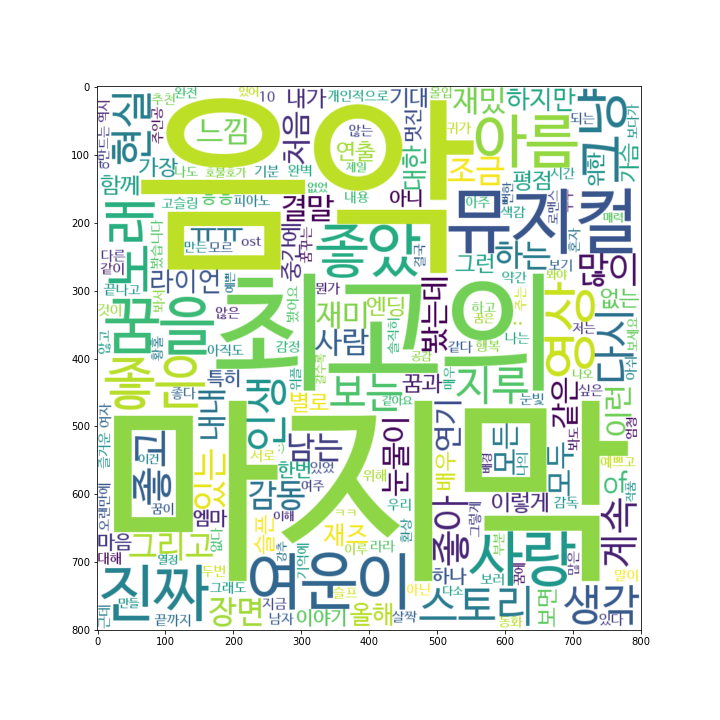

# KR-WordRank: Unsupervised Korean Word & Keyword Extractor

- pure Python code
- author: Lovit (Hyunjoong Kim)
- reference: [Kim, H. J., Cho, S., & Kang, P. (2014). KR-WordRank: An Unsupervised Korean Word Extraction Method Based on WordRank. Journal of Korean Institute of Industrial Engineers, 40(1), 18-33][paper]

## Usage

Substring graph를 만들기 위하여 substring의 최소 등장 빈도수 (min count)와 substring의 최대 길이 (max length)를 입력해야 합니다. 

```python
min_count = 5   # 단어의 최소 출현 빈도수 (그래프 생성 시)
max_length = 10 # 단어의 최대 길이
wordrank_extractor = KRWordRank(min_count, max_length)
```

KR-WordRank는 PageRank 와 비슷한 graph ranking 알고리즘을 이용하여 단어를 추출합니다 (HITS algorithm 을 이용합니다). Substring graph에서 node (substrig) 랭킹을 계산하기 위하여 graph  ranking 알고리즘의 parameters 가 입력되야 합니다. 

```python
beta = 0.85    # PageRank의 decaying factor beta
max_iter = 10
verbose = True
texts = ['예시 문장 입니다', '여러 문장의 list of str 입니다', ... ]
keywords, rank, graph = wordrank_extractor.extract(texts, beta, max_iter, verbose)
```

Graph ranking 이 높은 노드들(substrings)이 후처리 과정을 거쳐 단어로 출력됩니다. 영화 '라라랜드'의 영화 평 데이터에서 키워드 (단어) 추출을 한 결과 예시가 tutorials에 있습니다.

```python
for word, r in sorted(keywords.items(), key=lambda x:x[1], reverse=True)[:30]:
        print('%8s:\t%.4f' % (word, r))
```

      영화:    229.7889
     관람객:   112.3404
      너무:    78.4055
      음악:    37.6247
      정말:    37.2504
            ....

Python 의 wordcloud package 를 이용하면 키워드에 관한 word cloud figure 를 그릴 수 있습니다.

Figure 에 나타내지 않을 일반적인 단어 (stopwords) 를 제거하여 passwords 를 만듭니다. dict 형식으로 {단어:점수} 형식이어야 합니다. 

```python
stopwords = {'영화', '관람객', '너무', '정말', '보고'}
passwords = {word:score for word, score in sorted(
    keywords.items(), key=lambda x:-x[1])[:300] if not (word in stopwords)}
```

wordcloud 가 이용하는 기본 폰트는 한글 지원이 되지 않습니다. 한글을 지원하는 본인의 폰트를 찾아 font_path 를 준비합니다. 그림의 크기 (width, height) 와 배경색 (background_color) 등을 지정한 뒤, generate_from_frequencies() 함수를 이용하여 그림을 그립니다.

```python
from wordcloud import WordCloud

# Set your font path
font_path = 'YOUR_FONT_DIR/truetype/nanum/NanumBarunGothic.ttf'

krwordrank_cloud = WordCloud(
    font_path = font_path,
    width = 800,
    height = 800,
    background_color="white"
)

krwordrank_cloud = krwordrank_cloud.generate_from_frequencies(passwords)
```

Jupyter notebook 에서 그림을 그릴 때에는 반드시 아래처럼 %matplotlib inline 을 입력해야 합니다. .py 파일로 만들 때에는 이를 입력하지 않습니다.

```python
%matplotlib inline
import matplotlib.pyplot as plt

fig = plt.figure(figsize=(10, 10))
plt.imshow(krwordrank_cloud, interpolation="bilinear")
plt.show()
```

그려진 그림을 저장할 수 있습니다. 

```python
fig.savefig('./lalaland_wordcloud.png')
```

저장된 그림은 아래와 같습니다. 



## Setup

    pip install krwordrank


## Requirements

- Python >= 3.5 (Python 2.x 에서는 테스트 하지 않았습니다)
- numpy 

[paper]: https://github.com/lovit/KR-WordRank/raw/master/reference/2014_JKIIE_KimETAL_KR-WordRank.pdf
